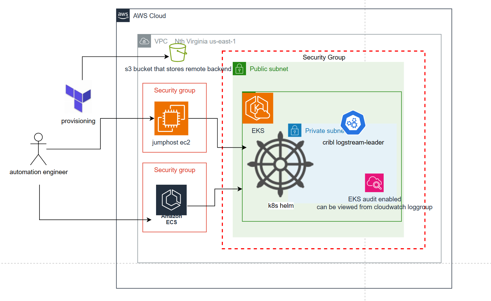
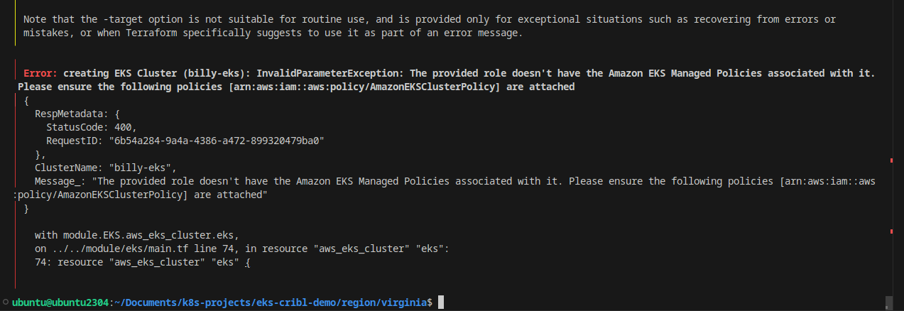
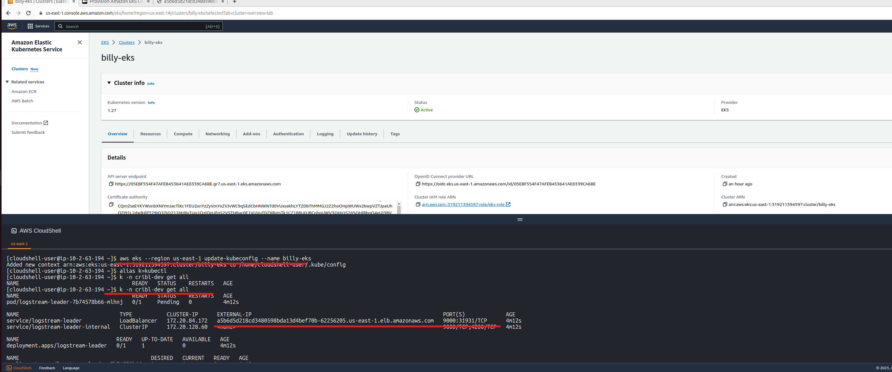
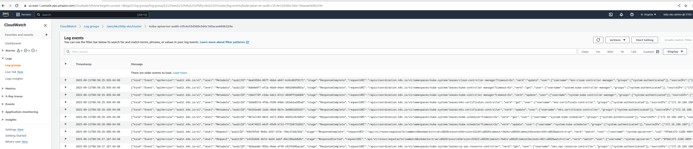

## about DEMO

This demo is to build an AWS EKS and then joins the helm chart kube-config setting to EKS, finally install cribl leader via Helm Chart.
Due to the scary cpu/ram utilization of cribl, the EKS nodes are built with m5a.4xlarge ec2 instance. 


## Original Design

- all input variables are declared under folder region/xxxx/locals.tf and partially in main.tf for the module outputs
- create VPC
- create EKS and nodes
- eks cluster role has these permissions

CloudWatchFullAccess
AmazonEKSClusterPolicy
AmazonEKSVPCResourceController
AmazonEC2ContainerRegistryReadOnly
AmazonEKSWorkerNodePolicy

- node group role have these permissions

CloudWatchFullAccess
AmazonEKSWorkerNodePolicy
AmazonEKS_CNI_Policy
CloudWatchAgentServerPolicy
AmazonEC2RoleforSSM
AmazonEC2FullAccess
AmazonEC2ContainerRegistryReadOnly
AmazonSSMFullAccess

- Helm connects to EKS with certificate authority

```
provider "helm" {
  kubernetes {  
    host                   = local.eks_cluster_endpoint
    cluster_ca_certificate = base64decode(local.eks_certificate_authority_data)
    exec {
      api_version = "client.authentication.k8s.io/v1beta1"
      args        = ["eks", "get-token", "--cluster-name", local.eks_cluster_name]
      command     = "aws"
    }
  }
}
```


- Cribl logstream leader helm setup is the declarative command for the imperative command `helm --create-namespace -n "cribl" install logstream-leader cribl/logstream-leader --set config.adminPassword="criblleader" --set "config.groups={group1,group2}" --set config.token="ABCDEF01-1234-5678-ABCD-ABCDEF012345" --set config.host="localhost"`

- (**incomplete**) For security purpose, it's recommended to access EKS kubectl through a bastion. Jumphost can be either built on EC2 or ECS
	





folder tree
```
.
├── module
│   ├── eks
│   │   ├── locals.tf
│   │   ├── main.tf
│   │   ├── outputs.tf
│   │   └── variables.tf
│   ├── helmcribl
│   │   ├── locals.tf
│   │   ├── main.tf
│   │   ├── outputs.tf
│   │   ├── providers.tf
│   │   ├── templates
│   │   └── variables.tf
│   └── networking
│       ├── locals.tf
│       ├── main.tf
│       ├── outputs.tf
│       └── variables.tf
├── README.md
├── region
│   └── virginia
│       ├── locals.tf
│       ├── main.tf
│       ├── outputs.tf
│       ├── providers.tf
│       └── variables.tf
└── setup
    ├── locals.tf
    ├── main.tf
    ├── outputs.tf
    ├── providers.tf
    └── variables.tf
```

## Prerequisites

+ Create an aws account with the IAM `AdministratorAccess` permission

+ Configure Access Key and Secret Access Key

**NOTE**: **MUST** use the Access Key and Secret Access Key of user that created EKS

```shell
$ aws configure
AWS Access Key ID [*******************]: 
AWS Secret Access Key [*********************]: 
Default region name [us-east-1]: 
Default output format [json]
```


## Install 

### Setup environment

Terraform saves all changes in `*.tfstate` file, so we'd better store `*.tfstate` in `aws s3 bucket` instead of local machine. 
Go to `cd setup` folder, build a `aws s3 bucket` to store `*.tfstate` file.

+ Init Terraform

```shell
$ cd setup
$ terraform init
```

+ Create s3 bucket
```shell
$ terraform apply
```

Enter an `aws region code`, such as `us-east-1`. After that, you need to make sure the listed resources that will be crated and then enter `yes`

You can see the output `s3_bucket_terraform_state` below
```shell
Outputs:

s3_bucket_terraform_state = "**********-us-east-1"
```

### Build resources

Now begin to build the resources including VPC, subnets, EKS, helm cribl etc.

+ Setup remote tfstate storage
```shell
$ cd ../region/virginia 
```
and then, update the block of `s3` in `providers.tf` file
```terraform
backend "s3" {
    bucket  = "**********-us-east-1"
    key     = "terraform/backend.tfstate"
    region  = "us-east-1"
    encrypt = "true"
  }
```

The following things maybe need to be modified:
1. Set `bucket` as the output of `s3_bucket_terraform_state`
2. Set `key` as the path to store `*.tfstate` file in s3 bucket
3. Update `region` as the region code that you entered when creating s3 bucket above
4. Set `encrypt` as `true`


+ Create resources

You can modify the configuration in the `main.tf` file according to your needs, and then run the following commands
```shell
$ terraform init
$ terraform apply
```

You will be prompted to enter `yes` after confirmed the listed resources.


It may show up error that module.helmcribl will be provisioned before EKS creation. This cannot be bypassed with depends_on command due to module.helmcribl works with its own providers.tf.


terraform plan -target=module.helmcribl

terraform apply -target=module.helmcribl

occasionally error, try re-running with terraform plan
terraform apply           several times to get it working




+ Update or create kubeconfig in AWS CloudShell

```shell
aws eks --region region-code update-kubeconfig --name cluster_name
```
`region-code` is aws region code, such as `us-east-1`

`cluster-name` is the name of the created EKS

+ Access EKS cluster

```shell
kubectl -n cribl-dev get svc
```

see the cribl logstream leader is running
External kubernetes LoadBalancer port and URL addresses are shown





+ cloudwatch loggroup is capturing the billy-eks cluster audit log




## Uninstall

run
```
terraform destroy --auto-approve
```


If some resources can't be destroyed, like EKS cluster, eks-role, just delete them manually from AWS console > EKS and IAM role

And then go to s3 bucket to delete the tfstate file before getting stucked at re-running "terraform plan" again.